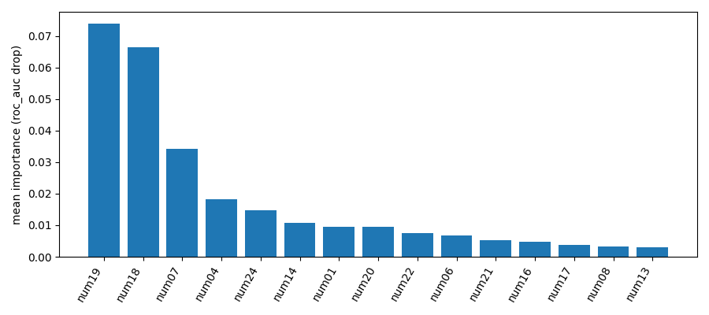

# HW06 – Report

> Файл: `homeworks/HW06/report.md`  
> Важно: не меняйте названия разделов (заголовков). Заполняйте текстом и/или вставляйте результаты.

## 1. Dataset

- Какой датасет выбран: `S06-hw-dataset-01.csv`
- Размер: (12000, 30)
- Целевая переменная: `target`
    - 0  -  0.676583
    - 1  - 0.323417
- Признаки: числовые float64

## 2. Protocol

- Разбиение: test_size=0.25, random_state=42
- Подбор: CV на train по ROC-AUC
- Метрики: accuracy, F1, ROC-AUC уместны потому что задача классификации
 
## 3. Models

{
  "HistGradientBoosting": {
    "accuracy": 0.9363333333333334,
    "f1": 0.8982418753329782,
    "roc_auc": 0.9746823421867858
  },
  "RandomForest": {
    "accuracy": 0.9346666666666666,
    "f1": 0.8942826321467098,
    "roc_auc": 0.97060992331522
  },
  "DecisionTree": {
    "accuracy": 0.8633333333333333,
    "f1": 0.7848898216159497,
    "roc_auc": 0.9105332385353713
  },
  "LogisticRegression": {
    "accuracy": 0.8296666666666667,
    "f1": 0.7146845337800112,
    "roc_auc": 0.878905083540704
  },
  "Dummy": {
    "accuracy": 0.5623333333333334,
    "f1": 0.3256291730868002,
    "roc_auc": 0.5008404855009903
  }
}

## 4. Results

|	| accuracy |f1 |	roc_auc	|model|
|--|--|--|--|--|
|0|0.562333|	0.325629|	0.500840|	Dummy(most_frequent)|
|1|0.829667|	0.714685|	0.878905|	LogReg(scaled)|
|2|0.863333|	0.784890|	0.910533|	DecisionTree|
|3|0.934667|	0.894283|	0.970610|	RandomForest|
|4|0.936333|	0.898242|	0.974682|	HistGradientBoosting|

## 5. Analysis

- Устойчивость: что будет, если поменять `random_state` (хотя бы 5 прогонов для 1-2 моделей) – кратко
- Ошибки: confusion matrix для лучшей модели + комментарий
- Интерпретация: permutation importance (top-10/15) + выводы

## 6. Conclusion
Bagging деревьевья дают лучший результат, но требуют больше ресурсов для обучения.
Оценивать важность признаков - хорошая практика.
